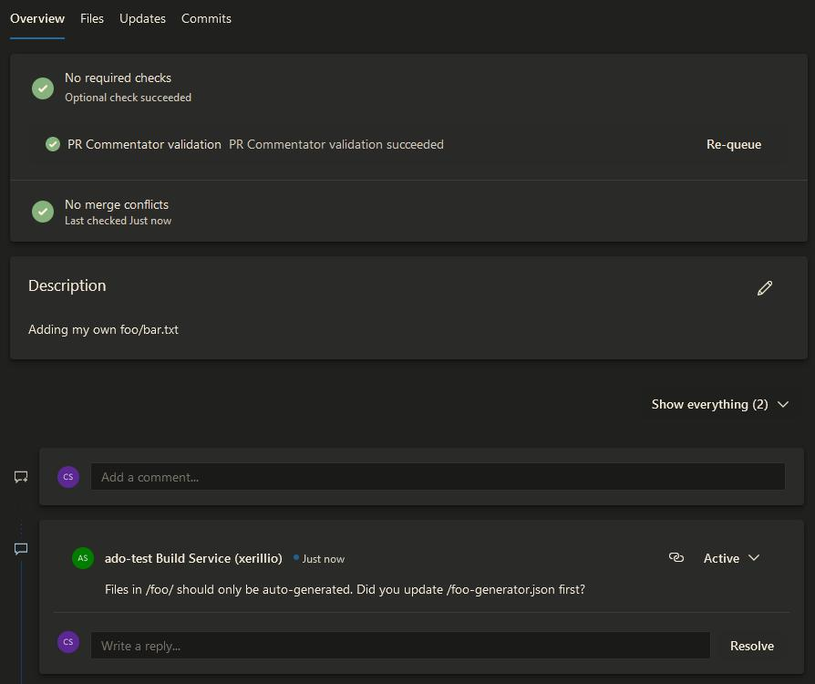

# Azure DevOps Pull Request Commentator

Improve your code review process by automating comments to avoid common mistakes or remind the developer of possible dependencies outside the pull request.

## Setting up the task

Install the extension in your collection and create a pipeline. Add the `PrCommentator` task to the YAML file and configure the inputs as you see fit:

```yml
- task: PrCommentator@0
  inputs:
   comment: 'Files in /foo/ should only be auto-generated. Did you update /foo-generator.json first?'
   fileGlob: '/foo/**/*'
```

This will generate a comment like the following:



## Inputs

The task supports the following inputs:

| Input      | Example                    | Description                  |
| ---------- | -------------------------- | ---------------------------- |
| `PAT`      | `PAT: 'abd123'`            | A [Personal Access Token](https://learn.microsoft.com/en-us/azure/devops/organizations/accounts/use-personal-access-tokens-to-authenticate) for the identity used to create the comments. If not specified, the pipeline's build service user is used. |
| `comment`  | `comment: 'The is the text inserted into the comment'` | A string with the content of the comment. [Markdown](https://learn.microsoft.com/en-us/azure/devops/project/wiki/markdown-guidance?view=azure-devops) is supported. |
| `fileGlob` | `fileGlob: '/foo/**/*.js'` | A glob expression. The pull request must have a file matching the expression for the comment to be added. See [supported features](https://github.com/isaacs/minimatch#features). |


## Roadmap

Below is a list of coming features and future plans:

* (Input) `fileGlob`
  * Support multiple globs
  * Support "negative" globs: add comment if no file matching the glob is included in the PR
* (Input) Commit message expression: add a comment based on the commit messages
* (Input) Branch name: add a comment based on the source or target branch name
* (Input) Auto-resolve: automatically resolve or reopen a comment based on new updates to the PR
